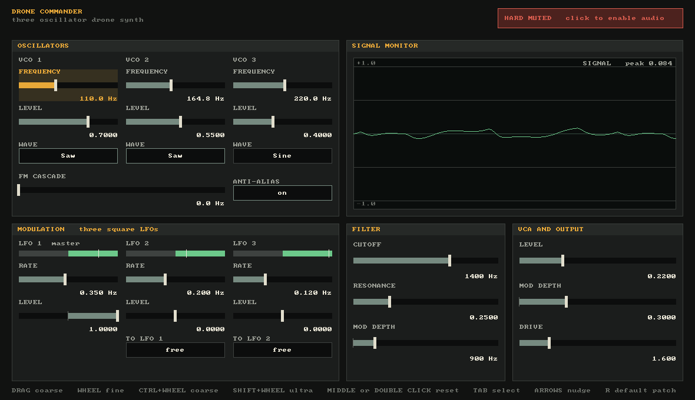

# Drone Commander

A C17 synthesizer and signal-path laboratory hosted by SDL3. It is the digital
sketchbook for a later, separate, fully analog hardware synthesizer.

## Safety

**Audio always starts hard-muted.** The SDL audio device is opened paused, and
the audio callback does not run until you deliberately press `Ctrl+Shift+A` or
click the red `HARD MUTED` banner at the top right. Press `Space` or click the
banner again, now green and reading `AUDIO LIVE`, to mute immediately. The
visualization runs while muted, so no audio output is required to explore the
controls.

## Build

Drone Commander is built from the repository root along with the rest of the
lab. See the [root README](../../README.md) for the one-time toolchain install,
then:

```sh
make run-drone
```

The executable lands in `build/bin/drone_commander.exe`, and `make test` runs
the DSP tests together with the fader tests from `shared/param`. Dependencies
are SDL3 from pkg-config, CMake, Ninja and a C17 compiler; nothing is
downloaded at configure time.

## Controls



Every continuous control is a fader, the lab's shared control from
`shared/param` and `shared/ui`, so these gestures belong to the lab rather
than to this app; vsynth adopts them in ROADMAP P4 (see
[ROADMAP](../../ROADMAP.md) section 6):

| Gesture | Effect |
|---|---|
| Drag the track | absolute, follows the pointer |
| Wheel | one fine step on the control under the pointer, or the selected one when the pointer is over nothing |
| Ctrl + wheel | one coarse step |
| Shift + wheel | one ultra-fine step |
| Middle click, or double click | reset to the neutral |
| `Tab`, `Shift+Tab` | select the next or previous control |
| Arrows | nudge the selected control; Ctrl coarse, Shift ultra-fine |
| `Backspace` | reset the selected control to its neutral |

A fader shows its value at full precision with its unit, and the faint tick on
the track is its neutral, so you can see where a reset will land. Frequencies
are on an exponential track, which is what makes a 20 Hz to 12 kHz cutoff
dialable at both ends; the ultra grain reaches 1 Hz, so an exact 440 Hz is a
few scroll clicks rather than a pixel hunt. The window title carries the mute
state and names the selected control and its value. The footer line at the
bottom of the panel spells the gestures out.

Switches and enum steppers (wave, anti-alias, LFO sync) advance on click,
wheel or arrow key and wrap. Anti-alias is on by default.

The rest:

- `R`: back to the default patch. That is not the same as resetting every
  fader to its neutral: the default patch has LFO 1 at full level, 900 Hz of
  filter modulation and some VCA modulation, where the neutrals of those three
  are zero.
- `Ctrl+Shift+A` or click the banner: deliberately enable audio
- `Space` or click the banner: mute audio immediately
- `F12`: save a screenshot to the app's data folder, or to `--shots DIR`;
  `--screenshot FILE.bmp` saves one two seconds after start. Both come from the
  shell, so every app has them.
- `Escape`: quit

## Signal Path

The panel has five sections: `OSCILLATORS`, `SIGNAL MONITOR`, `MODULATION`,
`FILTER` and `VCA AND OUTPUT`. The signal path below follows them.

### Oscillators

3 oscillators with selectable waveforms (Sine, Saw, Square, Triangle), each with:

- Frequency, on an exponential fader from 20 Hz to 2 kHz
- Level, 0 to 1
- Pulse width, the duty cycle of the square from 0.02 to 0.98

Pulse width moves the falling edge of the square; the rising edge stays at the
start of the cycle. It does nothing to the other three waveforms. It also
introduces a DC offset of `2 * duty - 1`, which is deliberate: an analog VCO
does the same, and that offset biases the soft-saturation stage asymmetrically,
which is a large part of what pulse width actually sounds like.

There is no phase control. A free-running drone oscillator's absolute phase is
inaudible; phase only becomes a control when something retriggers it.

### FM Cascade

Linear frequency modulation: Oscillator 1 modulates Oscillator 2, and Oscillator 2
modulates Oscillator 3. `FM CASCADE` runs 0 to 1000 Hz. At zero the oscillators
remain independent; turning it up creates classic analog drone sidebands,
sub-harmonics, and metallic timbres.

### Anti-Aliasing (PolyBLEP)

Toggleable between naive digital phase accumulation and polynomial band-limited
step (PolyBLEP) correction for saw and square waves. Allows direct comparison of
aliasing noise versus clean analog-like harmonic spectrums.

### Parameter Smoothing

One-pole lowpass filter smoothing on cutoff, resonance, VCA amplitude, drive,
FM depth and the three LFO levels, to prevent clicks and zipper noise during
real-time adjustments.

### Mix and drive

Combines the three oscillators with adjustable `tanhf` soft-saturation drive,
0.1 to 8. `DRIVE` sits in the `VCA AND OUTPUT` section of the panel.

### Filter

State-variable low-pass:

- Cutoff, exponential from 20 Hz to 12 kHz
- Resonance, 0 to 1
- Mod depth, 0 to 6000 Hz of cutoff movement driven by the LFO sum

### VCA

- Level, 0 to 0.8
- Mod depth, 0 to 1, driven by the LFO sum

### Modulation (3 x Square LFO)

Each LFO has an independent rate, exponential from 0.01 to 20 Hz, and a level.
Their outputs are summed and routed to both the filter and VCA mod-depth
controls.

**Level runs -1 to +1.** The square wave itself alternates between `-1` and
`+1`, and the level scales it, so a negative level is the same amount of
modulation with its sign flipped. Zero, in the middle of the track, is no
modulation at all and is where a reset lands. Two LFOs at opposite levels
cancel; one inverted against another at the same rate is a way to get a
narrower sweep than either alone.

When the levels' **magnitudes** add up to more than 1, the sum is divided by
that total, so stacking LFOs never exceeds full depth and inverting one changes
the shape of the modulation without changing its overall depth. Below 1 the sum
passes through as it is.

Each LFO shows its phase as a single bar, split where the sign changes: red on
the negative half, green on the positive, with the live half lit and a marker
riding the current phase.

LFO 2 can hard-sync to LFO 1, and LFO 3 can hard-sync to LFO 2. A synced LFO
resets its phase whenever the preceding LFO begins a new cycle. This corresponds
to a reset pulse between comparator-based analog LFOs on the eventual hardware.

### Signal monitor

- Zero-crossing triggered oscilloscope for a rock-solid, jitter-free visual
  trace, two and a half cycles of the lowest oscillator wide, with gridlines at
  +1, +0.5, -0.5 and -1
- A peak readout in the corner of the scope that turns red above 0.98

The scope is fed by its own preview copy of the synth, rendered fresh every
frame from the current panel values, so it shows the patch even while the
audio is muted.